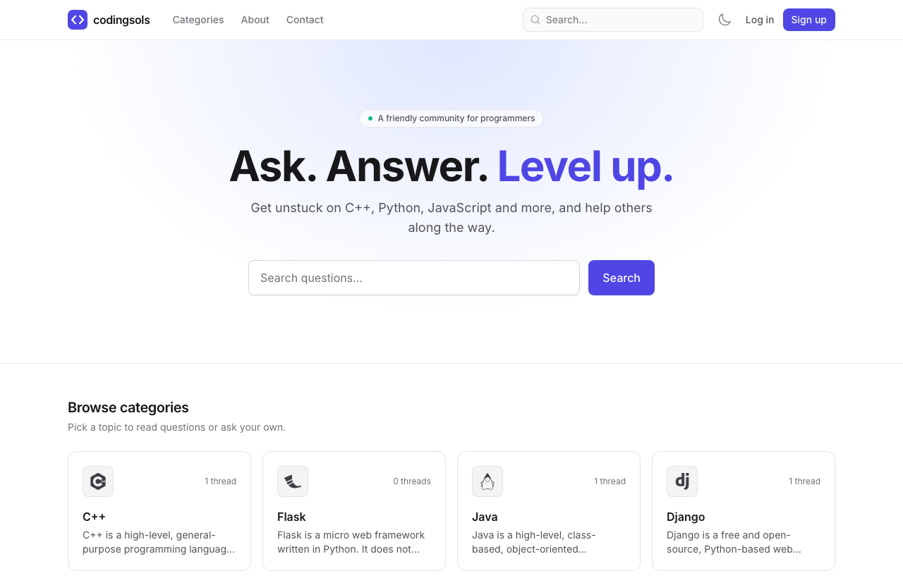
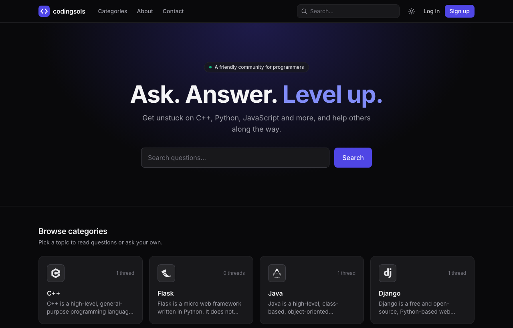
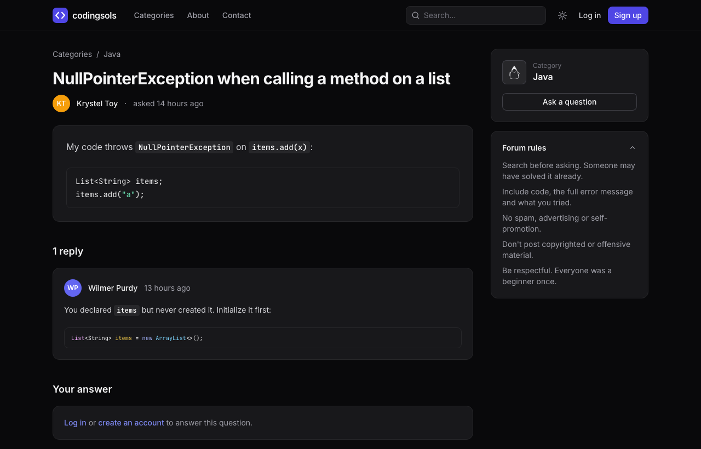

# Codingsols

A community forum where programmers ask questions, share answers and help each other level up.

[](https://github.com/nevil-codes/codingsols/actions/workflows/ci.yml)
[](LICENSE)



| Dark mode | Thread with syntax highlighting |
| --- | --- |
|  |  |

## Features

- **Categories** for C++, Python, Java, JavaScript, Django, Flask, C# and Ruby
- **Questions and answers** written in Markdown, with a live preview and syntax-highlighted code blocks
- **Accounts**: sign up, log in, email verification, password reset and profile settings
- **Ownership rules**: only authors can edit or delete their questions and replies
- **Voting and accepted answers**: upvote or downvote questions and replies, the asker marks the answer that solved it, and lists sort by Latest, Top or Unanswered
- **Tags** on questions (up to 5), with tag pages and a tag directory
- **Search** across questions and replies, matching every word in any order, with highlighted results
- **Moderation**: members can report posts; admins get a reports queue, can lock threads, delete posts, manage categories and read contact messages
- **Activity page** listing your questions and recent replies
- **Light and dark themes** that follow your system setting, with a manual toggle
- **Responsive and accessible**: mobile layout, keyboard navigation, skip link and visible focus states
- **Secure by default**: CSRF protection, escaped output, safe Markdown (raw HTML and `javascript:` links are stripped), per-user rate limits on posting, voting and reporting, a honeypot and timing check against bots on sign-up and the contact form, and `nofollow ugc` on links in posts

## Tech stack

| Layer | Tools |
| --- | --- |
| Backend | PHP 8.4+, Laravel 13, Breeze (auth) |
| Frontend | Blade, Tailwind CSS, Alpine.js, highlight.js |
| Database | SQLite locally, PostgreSQL in production (tested in CI on both) |
| Testing | Pest, Laravel Pint |
| CI | GitHub Actions: Pint, tests on SQLite and PostgreSQL, Docker image smoke test |
| Deployment | Docker (Nginx + PHP-FPM), queue worker, scheduler |

## Getting started

Requirements: PHP 8.4+, Composer and Node.js 20+.

```bash
git clone https://github.com/nevil-codes/codingsols.git
cd codingsols

composer install
npm install

cp .env.example .env
php artisan key:generate

touch database/database.sqlite
php artisan migrate --seed

composer run dev
```

Open http://localhost:8000. In the `local` environment, the seeder creates sample questions and a demo account:

- **Email:** `demo@codingsols.test`
- **Password:** `password`

Emails (verification, password reset) are written to `storage/logs/laravel.log` by default. Set the `MAIL_*` variables in `.env` to send real mail.

The demo account is an admin, so you can try the admin area at `/admin`.

### Admins

Give an account admin rights (or take them away) with:

```bash
php artisan app:make-admin someone@example.com
php artisan app:make-admin someone@example.com --revoke
```

### Using MySQL instead of SQLite

Update `.env`:

```dotenv
DB_CONNECTION=mysql
DB_HOST=127.0.0.1
DB_PORT=3306
DB_DATABASE=codingsols
DB_USERNAME=your_user
DB_PASSWORD=your_password
```

Then run `php artisan migrate --seed`.

### Search

Search runs on [Laravel Scout](https://laravel.com/docs/scout). By default it uses the database driver (`SCOUT_DRIVER=database`), which needs no extra services and matches every word of the query in titles, bodies and replies. For typo tolerance and relevance ranking on a larger site, switch to [Meilisearch](https://www.meilisearch.com) or [Typesense](https://typesense.org): install the client package, set `SCOUT_DRIVER`, then run `php artisan scout:import "App\Models\Thread"` and `php artisan scout:import "App\Models\Comment"`.

## Deployment

Codingsols ships as a Docker image that runs on any container host, with PostgreSQL, Resend for email and optional Cloudflare Turnstile. See [DEPLOYMENT.md](DEPLOYMENT.md) for setup, platform guides, backups and troubleshooting.

## Running tests

```bash
php artisan test        # Pest test suite
vendor/bin/pint --test  # code style check
```

## Project structure

```
app/Http/Controllers   Home, categories, threads, comments, search, contact
app/Models             Category, Thread, Comment, ContactMessage, User
app/Policies           Who can edit or delete threads and comments
database/seeders       Categories, plus demo content for local development
resources/views        Blade pages and reusable components (resources/views/components)
tests/Feature          HTTP tests for every feature
legacy/                The original plain-PHP version, kept for reference
```

## Roadmap

Planned work is tracked in [GitHub issues](https://github.com/nevil-codes/codingsols/issues) and [milestones](https://github.com/nevil-codes/codingsols/milestones): tags, voting and accepted answers, moderation tools, and deployment.

## Contributing

Contributions are welcome. Please read [CONTRIBUTING.md](CONTRIBUTING.md) and the [Code of Conduct](CODE_OF_CONDUCT.md). Issues labeled [`good first issue`](https://github.com/nevil-codes/codingsols/labels/good%20first%20issue) are a good place to start.

## Security

Please report vulnerabilities privately. See [SECURITY.md](SECURITY.md).

## License

Released under the [MIT License](LICENSE).
